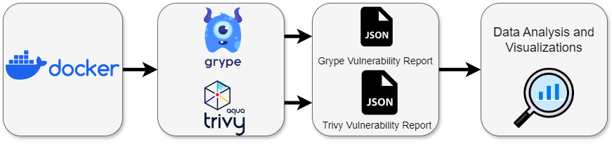

# msusel-SATComparison-Pipe
#  Funding Agency:  
 

## Zenodo

## Introduction
This is a pipeline for collecting and analyzing the results of static analysis tools
over Docker images. The idea is to be able to compare each tools results to one another
when they both run over the same corpus of Docker images. Below is the flow diagram 
of the data pipeline and a brief summary of what each part does. 

00_DockerImages:
Here we collect a list of Docker Official images to run our tools over. 

01_ToolVersions:
Here given a list of versions, we download each tool in the respective versions 
onto our local machine. 

02_DataAcquisition:
Here we run the corpus of Docker images through each version of each tool and collect
the results. 

03_Processing:
Here we process the tools reports, building data frames from each version or each tool. 
The dataframes include information on the images a vulnerability was found, the vulnerability ID,
the severity, count in that image and if the tool is Grype also includes a related vulnerability ID.

04_DataAnalysis:
Here we build violin plots of the difference between each tool's reported number of vulnerabilities,
we build scatter plots of the different configurations of Grypes reported occurrences of 
related vulnerabilities in the same images. We also have stacked bar plots for the top ten most vulnerable 
images, and each tools respective different severity counts. Various statistics are calculated as well throughout
and printed out. These include average count per image, largest difference in counts, percent the agree on
vulnerability IDs in an image etc.

___
## Tools
Grype and Trivy 
___
## Building
Note you will need to download and configure the tools to use these static databases to replicate excact results. You can also replicate with more current versions of each tools database, or modify program so the tools automatically update their vulnerability databases, which is the standard configuration. Grype and Trivy databases can be found: https://drive.google.com/drive/folders/1AVvaWh7VHWPG5SG9Ni8cv6hsFT3DgqYh?usp=drive_link 

Trivy put the database in 01_ToolVersions/03_incremental 
Grype go into the config file in 01_ToolVersions/03_incremental and update cache-dir to where you local store Grype db. 

## Notes
